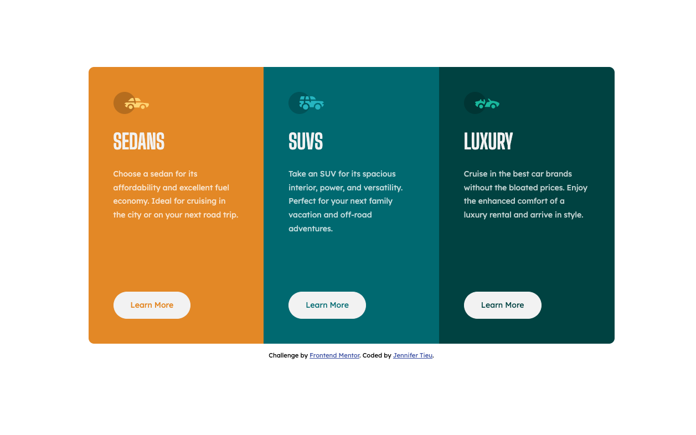

# Frontend Mentor - 3-column preview card component solution

This is a solution to the [3-column preview card component challenge on Frontend Mentor](https://www.frontendmentor.io/challenges/3column-preview-card-component-pH92eAR2-). Frontend Mentor challenges help you improve your coding skills by building realistic projects.

## Table of contents

- [Overview](#overview)
  - [The challenge](#the-challenge)
  - [Screenshot](#screenshot)
  - [Links](#links)
- [My process](#my-process)
  - [Built with](#built-with)
- [Author](#author)

## Overview

### The challenge

Users should be able to:

- View the optimal layout depending on their device's screen size

### Screenshot

### Links

- Solution URL: [Three Column Preview Card Solution](https://github.com/jennifertieu/fem-three-column-preview-card)
- Live Site URL: [Three Column Preview Card Site](https://jennifertieu.github.io/fem-three-column-preview-card/)

## My process

### Built with

- Semantic HTML5 markup
- CSS custom properties
- Flexbox
- Mobile-first workflow

### Useful resources

- [An Interactive Guide to Flexbox](https://www.joshwcomeau.com/css/interactive-guide-to-flexbox/) - An interactive guide to understanding flexbox.

## Author

- Website - [Jennifer Tieu](https://jennifertieu.com)
- Frontend Mentor - [@jennifertieuu](https://www.frontendmentor.io/profile/jennifertieuu)
- Twitter - [@jteacodes](https://www.twitter.com/jteacodes)
